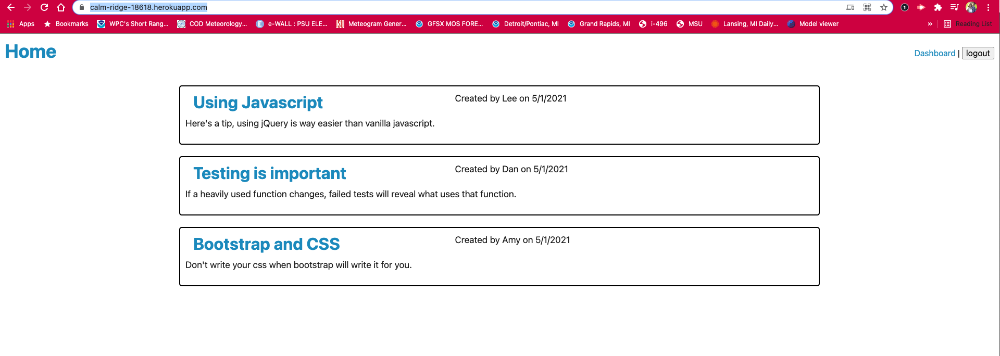
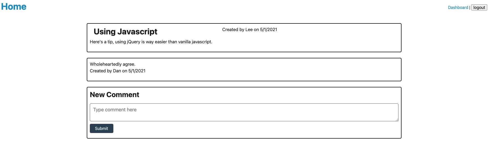
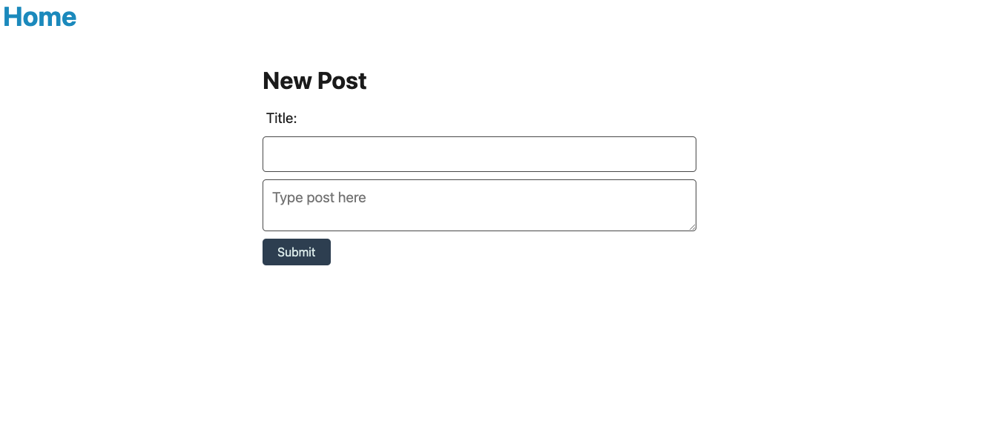
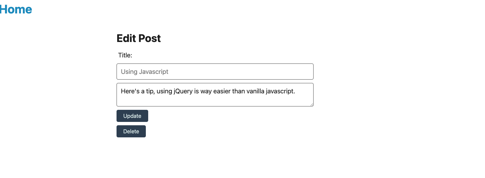
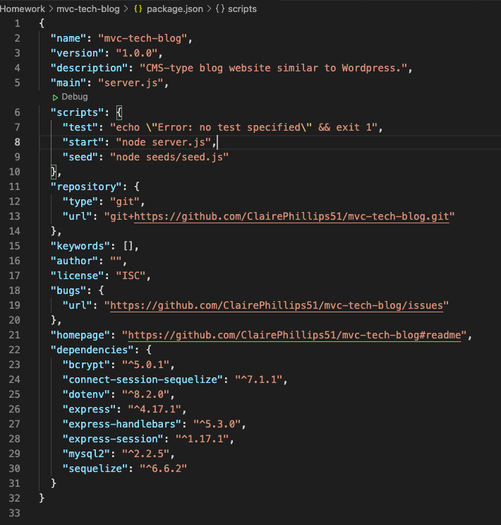
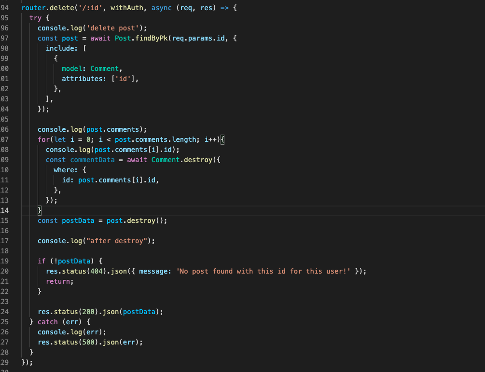

# mvc-tech-blog

## Links
Link to deployed application [Heroku Link](https://calm-ridge-18618.herokuapp.com/)

## Summary
CMS-type blog website similar to Wordpress. Making a fully functioning website with a front-end that connects to a back-end server following the MVC paradigm. Handlebars.js is the templating language and Sequelize as the object relational mapping. Express-session is used for authentication. 

## Table of Contents
1. [Usage](#usage)
2. [SetUp](#setup)
3. [What I Learned](#what-i-learned)
4. [Resources](#resources)

## Usage
Upon opening the app a user is sent to the homepage with the list of blogs (if there are any). If a user tries to click on a blog post they are redirected a sign in page where they can either login or sign up. Once that is completed a user is sent back to the homepage where they can now access blog posts and also comment on them. Once a user is logged in a dashboard link appears. From the dashboard a user can create, update or delete a blog post. 

### Adding comments to post view: 

### Logged in user creating a new blog post: 

### Options to edit or delete an existing blog: 

Unless a user signs up and is logged in they will not be able to comment or do any other activity. They will be redirected to the login/ sign up page.  A user also has the option to logout. If a user remains inactive for more than two hours the app will automatically log the user out. 

## Setup
This application is set up using the MVC paradigm and file structure. The controller and api folders hold all the different routes used. The controllers act as the interface between models and views. The models hold the models which store data for the database. The Public and View folders handle all the front-end components. The public folder handles the css and any middleware javascript files. The views folder holds all the handlebars files.

The backend required several npm packages to set up various functions. Express-handlebars was needed to implement handlebars.js. MySQL2 and Sequelize were needed to connect to the database. Dotenv for the environment variables, bcrypt to hash passwords, and express-sessions and connect-session-sequeliza for authentication. 

## What I Learned
Looking at the file structure all that was need for this project felt like a huge undertaking. Being able to copy and paste boiler plate code from the past weeks mini-project were extremelly helpful setting up the server.js file and the authentication process. 

I had trouble getting the posts to delete. The server would break trying to delete posts with comments because it would try to delete the post before deleting the comments. In the associations in the Index.js file the "onDelete: 'CASCADE'" wasn't working. I ended up having to manually go through the posts and delete comments so the post could be deleted.

## Resources
* [Npm Bcrypt](https://www.npmjs.com/package/bcrypt)
* [Express Handlebars](https://www.npmjs.com/package/express-handlebars)
* [Express Sessions](https://www.npmjs.com/package/express-session)
* [Deploying to Heroku with MySQL](https://coding-boot-camp.github.io/full-stack/heroku/deploy-with-heroku-and-mysql) 
* [JawsDB](https://devcenter.heroku.com/articles/jawsdb) 